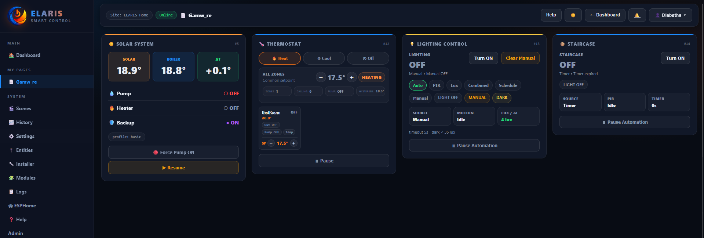

<p align="center">
  
</p>

<h1 align="center">ELARIS Core</h1>

<p align="center"><strong>Modular automation platform for homes, buildings, and light industrial control.</strong></p>

<p align="center">
  
  
  
  
  
</p>

<p align="center">
  <a href="https://elariscontrol.online">🌐 elariscontrol.online</a>
</p>

<p align="center">
  
</p>

<p align="center"><strong>Full platform for home users. Commercial licensing for professionals.</strong></p>

ELARIS Core is the open foundation of the ELARIS ecosystem — a runtime automation platform built around MQTT device integration, role-aware access control, and modular automation logic designed for real installations.

Built for real homes, real systems, and real commissioning workflows — not demos.

---

## Why ELARIS

ELARIS is designed for people who want more than hobby automation.

It combines:

- **MQTT-first device integration** for ESP32, ESP8266, and ESPHome-based hardware
- **Role-aware access control** for daily users, engineers, and admins
- **Modular automation logic** for lighting, HVAC, hydronic, irrigation, pool, energy, and more
- **Real-time system feedback** over WebSocket, without polling
- **A web UI with no build step**, designed for local deployment on Raspberry Pi, Linux, or Windows

ELARIS is intended for installations that need structure, visibility, and maintainable logic — from advanced homes to larger control environments.

---

## Free for home use

ELARIS Core includes **all automation modules** for:

- personal home use
- private labs
- test environments
- evaluation
- internal non-commercial development

If you are running ELARIS in your own home or building a personal automation system, you get the full platform — not a limited edition.

## Commercial license required

A commercial license is required for:

- paid client installations
- professional integrator or reseller deployments
- managed services
- white-label redistribution
- bundling into commercial products
- hospitality, office, industrial, or other professional multi-site installations

---

## What it does

**Devices & connectivity**
- Discovers and manages ESP32-based I/O nodes automatically over MQTT
- Supports Kincony KC868 series, WT32-ETH01, and generic ESPHome hardware
- Real-time device state and system feedback over WebSocket

**Automation**
- Runs automation modules with a 30-second tick engine
- Supports multi-zone and multi-site configurations
- Includes scenes, schedules, overrides, and modular runtime logic
- Uses a three-tier role model: User / Engineer / Admin

**ESPHome integration**
- Browse community ESPHome device profiles directly in the UI
- Flash devices from the browser over USB serial or OTA
- Generate custom firmware for ESP32 / ESP8266 boards
- Import existing ESPHome devices using the native API
- Monitor third-party ESPHome devices in read-only mode
- Extend devices with supported peripheral definitions

**Platform**
- Web-based UI — no app, no build step, works from any modern browser
- Runs on Raspberry Pi, Linux, or Windows
- Dark / light theme with system-aware behavior
- Designed for local-first installation and control

---

## Modules included

ELARIS Core includes the full automation platform for home and non-commercial use.

| Module | Description |
|--------|-------------|
| Lighting Control | PIR-based, lux sensor, schedule, dimmer |
| Smart Lighting | Scene-based moods, adaptive dimming, fade |
| Awning / Blind | Wind lockout, sun shading, position tracking |
| Thermostat | Multi-zone heating/cooling, window detection |
| Energy Monitor | Power tracking, tariff rates, peak detection |
| Presence Simulator | Anti-theft lighting and blind patterns |
| Maintenance Tracker | Service intervals and filter alerts |
| Scenes | Multi-device macros with trigger conditions |
| Solar | Solar control and energy-aware automation |
| Pool / Spa | Pumps, heating, timing, and protection logic |
| Irrigation | Scheduling, weather-aware watering, and zone control |
| Hydronic | Plant logic, pumps, mixing, and protection routines |
| Load Shifting | Smart load management and priority control |
| Custom Logic | Flexible project-specific automation behavior |

For **personal and non-commercial use**, all modules are available in ELARIS Core.  
For **commercial and professional deployment**, licensing terms apply.

---

## Tech stack

- **Runtime:** Node.js 20+
- **Database:** SQLite (via better-sqlite3)
- **Protocol:** MQTT (Mosquitto)
- **Hardware:** ESP32 / ESP8266 — Kincony KC868 series, WT32-ETH01, generic boards
- **Firmware:** ESPHome (auto-generated YAML, OTA flashing, native API import)
- **Frontend:** Vanilla HTML/CSS/JS — no build step

---

## Quick start

### Raspberry Pi / Linux (recommended)

```bash
git clone https://github.com/elaris-control/core.git
cd core
sudo bash install.sh
```

The installer sets up Node.js, Mosquitto, ESPHome, generates secrets, and starts ELARIS as a systemd service.

Open `http://<IP>:8080` — first run prompts you to create an admin account.

See [INSTALL.md](INSTALL.md) for details.

### Windows

```powershell
git clone https://github.com/elaris-control/core.git
cd core
npm install
```

See [INSTALL-WINDOWS.md](INSTALL-WINDOWS.md) for the full Windows setup guide.

---

## Role model

ELARIS uses a three-tier role system:

| Role | Access |
|------|--------|
| **User** | Daily control — scenes, overrides, status |
| **Engineer** | Commissioning — device setup, module config, IO mapping |
| **Admin** | System management — users, sites, database |

Engineer access is protected by a separate unlock layer, keeping commissioning controls away from daily users while preserving fast service access when needed.
